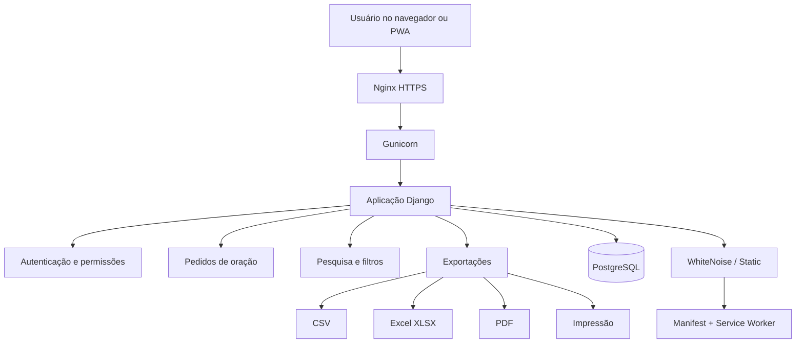

<div align="center">

# Grupo Rede - Pedidos de Oração

**Aplicação web responsiva para registrar, acompanhar, pesquisar e organizar pedidos de oração com controle de acesso, exportação e suporte a PWA.**


</div>

## Visão geral

O **Grupo Rede - Pedidos de Oração** é uma aplicação Django criada para registrar e acompanhar pedidos de oração de forma organizada, simples e adequada ao uso em desktop, celular e tablet.

O sistema mantém autenticação obrigatória, diferencia pedidos reservados, registra alterações, permite pesquisa por vários campos e oferece exportações para uso administrativo.

A interface foi projetada para reduzir atrito no cadastro e facilitar o uso diário por pessoas sem conhecimento técnico.

## Principais recursos

- autenticação de usuários;
- painel com indicadores dos pedidos;
- cadastro e edição de pedidos de oração;
- nome de quem fez o pedido;
- origem de quem fez o pedido;
- nome da pessoa por quem será feita a oração;
- texto completo do pedido;
- estados `Novo`, `Em oração` e `Encerrado`;
- pedidos reservados com regra de visibilidade;
- pesquisa por solicitante, beneficiário, origem e conteúdo;
- filtros por estado, privacidade e período;
- paginação;
- histórico de alterações para equipe administrativa;
- impressão de pedido individual;
- impressão da lista filtrada;
- exportação CSV;
- exportação Excel XLSX;
- exportação PDF;
- interface responsiva para desktop, celular e tablet;
- navegação mobile dedicada;
- PWA instalável pelo navegador;
- página offline básica;
- manifest e Service Worker;
- Gunicorn como servidor WSGI em produção;
- PostgreSQL 17;
- Docker Compose;
- WhiteNoise para arquivos estáticos;
- healthcheck HTTP do serviço web.

## Como funciona



## Modelo de dados

O núcleo do sistema é o modelo `PrayerRequest`, que registra:

| Campo | Finalidade |
|---|---|
| requester_name | nome de quem fez o pedido |
| requester_origin | cidade, estado, país ou origem informada |
| beneficiary_name | pessoa por quem será feita a oração |
| prayer_text | conteúdo do pedido |
| status | acompanhamento do pedido |
| is_reserved | controle de privacidade |
| created_by | usuário responsável pelo registro |
| created_at / updated_at | rastreabilidade temporal |
| closed_at | data de encerramento |

As alterações relevantes são registradas em `PrayerAudit`.

## Privacidade e permissões

Pedidos de oração podem conter informações pessoais sensíveis. O sistema foi estruturado para evitar exposição desnecessária.

Regras principais:

- acesso à aplicação exige autenticação;
- usuários comuns enxergam pedidos não reservados;
- pedidos reservados ficam visíveis ao criador e à equipe administrativa;
- usuários comuns somente editam pedidos criados por eles;
- usuários `staff` podem consultar todos os pedidos e o histórico de alterações;
- o banco PostgreSQL não publica sua porta no host;
- o arquivo `.env` não deve ser versionado;
- dumps do banco, backups e logs não devem ir para o GitHub.
- o repositório público contém somente código e configuração de exemplo; dados reais de pedidos não são versionados.

Consulte [`SECURITY.md`](SECURITY.md) antes de alterar regras de autenticação, privacidade ou exposição externa.

## PWA

O projeto inclui suporte a Progressive Web App:

- `manifest.webmanifest`;
- ícones 192x192 e 512x512;
- Service Worker com escopo `/`;
- página offline;
- modo `standalone`;
- instalação pelo menu do navegador compatível.

Para instalação, o acesso deve ser feito por **HTTPS** em navegadores compatíveis.

Consulte [`docs/PWA.md`](docs/PWA.md).

## Execução em produção

A aplicação roda em Docker com:

```text
Nginx HTTPS
    ↓
porta externa HTTPS
    ↓
Docker host :9400
    ↓
Gunicorn :8000
    ↓
Django
    ↓
PostgreSQL
```

O serviço PostgreSQL permanece somente na rede interna do Compose.

O container web executa, na inicialização:

1. `migrate`;
2. `collectstatic`;
3. Gunicorn com 2 workers.

Mais detalhes em [`docs/PRODUCTION.md`](docs/PRODUCTION.md).

## Instalação com Docker

### Requisitos

- Docker Engine;
- Docker Compose Plugin;
- porta `9400` disponível ou alterada no Compose;
- acesso HTTPS recomendado para uso como PWA.

Clone o repositório:

```bash
git clone https://github.com/EduMiranda78/pedido-oracao.git
cd pedido-oracao
```

Crie o arquivo de ambiente:

```bash
cp .env.example .env
```

Edite o `.env` e defina credenciais fortes.

Depois:

```bash
docker compose config --quiet
docker compose up -d --build
```

Valide:

```bash
docker compose ps
curl -fsS http://127.0.0.1:9400/health/
```

## Configuração

O projeto utiliza variáveis de ambiente para segredos e conexão com o banco.

Exemplo:

```env
COMPOSE_PROJECT_NAME=pedido_oracao
DJANGO_SECRET_KEY=troque-por-uma-chave-segura
DJANGO_DEBUG=False
DJANGO_ALLOWED_HOSTS=127.0.0.1,localhost
DJANGO_SECURE_COOKIES=False
DJANGO_CSRF_TRUSTED_ORIGINS=
POSTGRES_DB=pedido_oracao
POSTGRES_USER=pedido_oracao
POSTGRES_PASSWORD=troque-por-uma-senha-segura
POSTGRES_HOST=db
POSTGRES_PORT=5432
TZ=America/Sao_Paulo
```

Nunca publique o `.env`, credenciais reais, dumps PostgreSQL ou arquivos de backup.

## Estrutura do projeto

```text
pedido-oracao/
├── config/
│   ├── settings.py
│   ├── urls.py
│   ├── wsgi.py
│   └── asgi.py
├── prayers/
│   ├── migrations/
│   ├── admin.py
│   ├── forms.py
│   ├── models.py
│   ├── tests.py
│   ├── urls.py
│   └── views.py
├── templates/
│   ├── prayers/
│   ├── registration/
│   ├── base.html
│   └── offline.html
├── static/
│   ├── css/
│   ├── icons/
│   ├── js/
│   └── manifest.webmanifest
├── docs/
│   ├── ARCHITECTURE.md
│   ├── PRODUCTION.md
│   └── PWA.md
├── scripts/
│   ├── rebuild_web.sh
│   ├── validate.sh
│   └── github_preflight.sh
├── .github/
│   └── workflows/
│       └── ci.yml
├── Dockerfile
├── docker-compose.yml
├── requirements.txt
├── VERSION
└── .env.example
```

## Testes

Execute a suíte Django:

```bash
docker compose run -T --rm web python manage.py test prayers -v 2
```

Verifique migrations pendentes:

```bash
docker compose run -T --rm web \
  python manage.py makemigrations --check --dry-run
```

Validação do projeto:

```bash
docker compose run -T --rm web python manage.py check
```

Antes de qualquer push para o GitHub:

```bash
bash scripts/github_preflight.sh
```

O repositório também inclui validação automática com GitHub Actions.

## Deploy a partir do GitHub

Depois que o GitHub passar a ser a fonte oficial do código:

```bash
git fetch origin
git merge --ff-only origin/main

docker compose build web
docker compose up -d --no-deps --force-recreate web
```

Valide o healthcheck, os arquivos estáticos e os logs após o deploy.

## Roadmap

- [ ] administração de usuários pela própria interface;
- [ ] recuperação de senha por fluxo controlado;
- [ ] métricas administrativas por período;
- [ ] backup PostgreSQL automatizado e documentado;
- [ ] política de retenção de backups;
- [ ] testes adicionais de permissão e auditoria;
- [ ] configuração de HTTPS totalmente parametrizada por ambiente;
- [ ] documentação de restauração de desastre.

## Documentação

- [Arquitetura](docs/ARCHITECTURE.md)
- [Produção com Docker, Gunicorn e Nginx](docs/PRODUCTION.md)
- [Instalação PWA](docs/PWA.md)
- [Segurança](SECURITY.md)
- [Contribuição e manutenção](CONTRIBUTING.md)
- [Histórico de versões](CHANGELOG.md)

## Autor

Desenvolvido e mantido por **Eduardo Miranda**.

GitHub: [`EduMiranda78`](https://github.com/EduMiranda78)

## Licenciamento

Repositório público para consulta do código-fonte. O código permanece sob os direitos autorais do autor e não deve ser redistribuído, relicenciado ou utilizado comercialmente sem autorização.
