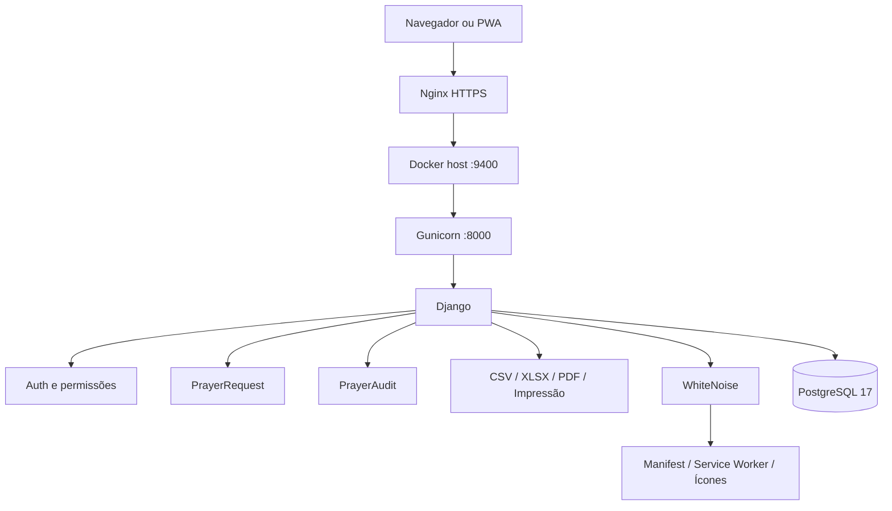

# Arquitetura

## Objetivo

O Grupo Rede - Pedidos de Oração utiliza uma arquitetura simples, previsível e adequada a uma aplicação administrativa de pequeno porte, com separação entre proxy HTTPS, aplicação Django e banco PostgreSQL.

## Fluxo principal



## Componentes

### Nginx

Responsável pela camada HTTPS e proxy reverso em produção.

O backend Django continua ouvindo na porta Docker configurada no Compose, enquanto o Nginx fornece a origem segura necessária para navegação pública e PWA.

### Gunicorn

Servidor WSGI de produção.

O Compose atual inicializa 2 workers e mantém logs em stdout/stderr do container.

### Django

Responsável por:

- autenticação;
- autorização;
- dashboard;
- cadastro e edição;
- pesquisa e filtros;
- regras de pedidos reservados;
- auditoria;
- exportações;
- templates;
- rotas públicas de healthcheck e recursos PWA.

### PostgreSQL

Armazena usuários, pedidos, auditorias e sessões Django.

O serviço `db` não publica a porta 5432 no host. A comunicação acontece pela rede interna do Compose.

### WhiteNoise

Serve os arquivos estáticos coletados por `collectstatic` dentro da aplicação.

### PWA

O projeto mantém:

- manifest;
- Service Worker;
- ícones 192 e 512;
- página offline;
- `display: standalone`.

## Regras de visibilidade

A camada de consulta aplica regras antes da renderização:

```text
staff
  └── vê todos os pedidos

usuário comum
  ├── vê pedidos não reservados
  └── vê os próprios pedidos reservados
```

A edição por usuário comum permanece limitada aos próprios pedidos.

## Auditoria

`PrayerAudit` registra alterações relevantes e permite rastrear ações administrativas sem depender exclusivamente de logs externos.

## Dados persistentes

Os dados persistentes ficam no volume PostgreSQL do Docker.

Arquivos abaixo não pertencem ao Git:

```text
.env
backups/
staticfiles/
media/
*.sql
*.dump
```
